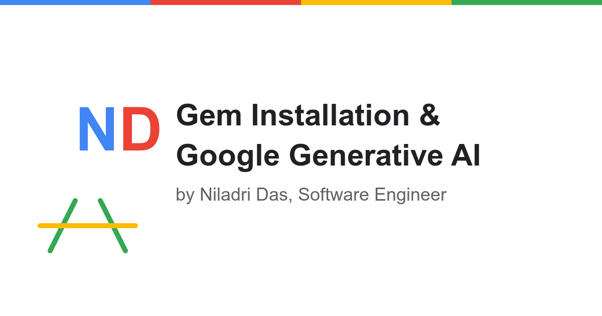

<div align="center">
  
  <h1>AI Search with Gemini API</h1>
  <p>
    <a href="https://github.com/bniladridas/gemini-ai-search/releases/tag/v1.0.1">
      
    </a>
    <a href="LICENSE">
      
    </a>
    <a href="#privacy-legal">
      
    </a>
    <a href="CHANGELOG.md">
      
    </a>
  </p>
</div>

This application provides a clean, minimal interface for searching and getting responses from Google's Gemini API, along with information about gem installation and algorithm problems.

<div align="center">
  
  <p><em>AI Search with Gemini API - Clean, minimal interface</em></p>
</div>

## Setup Instructions

1. **Install dependencies**:
   ```
   pip install -r requirements.txt
   pip install gTTS  # For text-to-speech functionality
   pip install google-genai  # For image generation functionality
   ```

2. **Set up your API key**:
   - Get a Gemini API key from Google AI Studio (https://ai.google.dev/)
   - Add your API key to the `.env` file:
     ```
     GEMINI_API_KEY=your_api_key_here
     ```

3. **Run the application**:
   ```
   python app.py
   ```

4. **Access the application**:
   Open your browser and go to `http://127.0.0.1:5001`

## Deploying to Vercel

1. **Install Vercel CLI**:
   ```
   npm install -g vercel
   ```

2. **Login to Vercel**:
   ```
   vercel login
   ```

3. **Deploy the application**:
   ```
   cd web
   vercel
   ```

4. **Set environment variables on Vercel**:
   - Go to your Vercel dashboard
   - Select your project
   - Go to Settings > Environment Variables
   - Add `GEMINI_API_KEY` with your API key

5. **Redeploy if needed**:
   ```
   vercel --prod
   ```

## Features

- Clean, minimal interface with harmonious typography
- Gem installation guide
- Algorithm problems and solutions
- AI search functionality using Google's Gemini 2.5 Flash Preview model
- Text-to-speech synthesis for AI responses
- AI image generation using Gemini 2.0 Flash
- Markdown support for formatted responses
- Mobile-friendly responsive design
- Comprehensive Privacy Policy and Terms of Service
- Standardized citation information via CITATION.cff for proper academic attribution

## Changelog

See the [CHANGELOG.md](CHANGELOG.md) file for a detailed history of changes to this project.

## How It Works

### Text Generation
1. The frontend sends your prompt to the Flask backend
2. The backend calls the Gemini API with your prompt
3. The response is returned and rendered as markdown in the browser
4. Optionally, you can click the "Listen" button to convert the response to speech
5. The text is sent to the server, converted to an MP3 file using Google's Text-to-Speech (gTTS), and played back in the browser

### Image Generation
1. Enter a description of the image you want to create
2. The frontend sends your prompt to the Flask backend
3. The backend calls the Gemini API with your prompt using the image generation model
4. The generated image is returned and displayed in the browser

## Effective Prompting

To get the best results from the Gemini API, it's important to craft effective prompts. Visit the [Google AI Studio documentation on prompting techniques](https://ai.google.dev/gemini-api/docs/prompting-intro#examples) to learn more about:

- Structuring your prompts
- Providing clear instructions
- Using examples (few-shot prompting)
- Optimizing for different types of tasks

## Python Code

### Gemini API Integration

The application uses the following Python code to interact with the Gemini API:

```python
import os
import google.generativeai as genai

# Configure the API
genai.configure(api_key=os.environ.get("GEMINI_API_KEY"))

# Create a model instance with the newer model
model = genai.GenerativeModel('gemini-2.5-flash-preview-04-17')

# Generate content
response = model.generate_content("Your prompt here")

# Print the response
print(response.text)
```

### Text-to-Speech Integration

The application uses Google's Text-to-Speech (gTTS) library to convert AI responses to speech:

```python
from gtts import gTTS
import os
import uuid
import tempfile

# Create a directory for temporary audio files
TEMP_AUDIO_DIR = os.path.join(tempfile.gettempdir(), 'gemini_tts')
os.makedirs(TEMP_AUDIO_DIR, exist_ok=True)

# Convert text to speech
def text_to_speech(text):
    # Generate a unique filename
    filename = f"{uuid.uuid4()}.mp3"
    filepath = os.path.join(TEMP_AUDIO_DIR, filename)

    # Convert text to speech
    tts = gTTS(text=text, lang='en', slow=False)
    tts.save(filepath)

    return filepath
```

### Image Generation Integration

The application uses Google's Gemini API to generate images from text descriptions:

```python
import os
import uuid
import tempfile
import mimetypes
from google import genai
from google.genai import types

# Create a directory for temporary image files
TEMP_IMAGE_DIR = os.path.join(tempfile.gettempdir(), 'gemini_images')
os.makedirs(TEMP_IMAGE_DIR, exist_ok=True)

# Initialize the client
client = genai.Client(
    api_key=os.environ.get("GEMINI_API_KEY"),
)

# Generate an image from text
def generate_image(prompt):
    # Set up the model and content
    model = "gemini-2.0-flash-exp-image-generation"
    contents = [
        types.Content(
            role="user",
            parts=[
                types.Part.from_text(text=prompt),
            ],
        ),
    ]

    # Configure the generation parameters
    config = types.GenerateContentConfig(
        response_modalities=["image", "text"],
        # Note: Do not use thinking_config with this model
    )

    # Generate the image
    response = client.models.generate_content(
        model=model,
        contents=contents,
        config=config,
    )

    # Return the generated image
    return response
```

## Citation

This project includes a `CITATION.cff` file that provides standardized citation information. If you use this software in your research or projects, please cite it using the information provided in this file.

You can cite this project in the following formats:

### APA Format
```
Das, N. (2025). AI Search with Gemini API (Version 1.0.0) [Computer software]. https://github.com/bniladridas/gemini-ai-search
```

### BibTeX Format
```bibtex
@software{Das_AI_Search_with_2025,
  author = {Das, Niladri},
  license = {All Rights Reserved},
  month = {4},
  title = {{AI Search with Gemini API}},
  url = {https://github.com/bniladridas/gemini-ai-search},
  version = {1.0.0},
  year = {2025}
}
```

For more information about the CITATION.cff format, visit [citation-file-format.github.io](https://citation-file-format.github.io/).

## Copyright

© 2025 Niladri Das. All rights reserved. Using this template or any part of this design is strictly prohibited without direct permission from the author.
